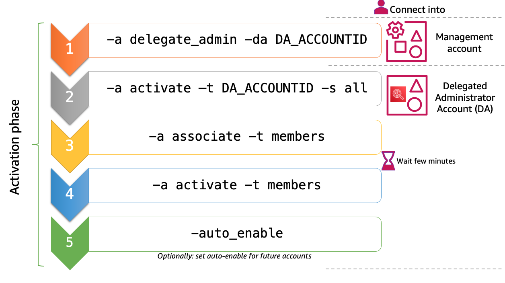
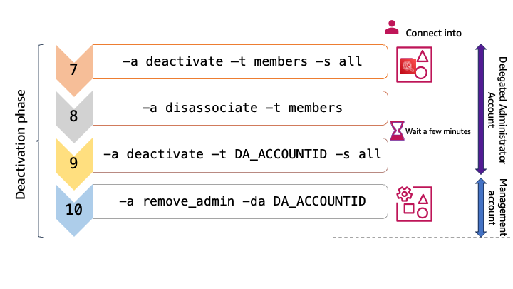

### 🚀 New Features released!
**📢Updates!** This repository is updated to support Amazon Inspector's latest capabilities : **EC2 Deep Inspection** and **Code repository** scanning.  With the new scan for Code repository released on June 17th, 2025, Amazon Inspector scans:

- 🔍 **First-party application source code** - Scan your custom application code for vulnerabilities
- 📦 **Third-party application dependencies** - Identify security issues in external libraries and packages  
- 🏗️ **Infrastructure as Code (IaC)** - Detect misconfigurations in your infrastructure templates

This repository has been enhanced to enable these powerful new scanning capabilities at scale across your multi-account, multi-region AWS organizations. You will be able to leverage these advanced security features seamlessly through the existing automation framework.

## 0. Important
### 0.0. Major updates
This repository has been updated to allow :
1. Manage **Code Repository** scan activation at scale: multi-accounts and multi-regions
2. Manage **EC2 Deep Inspection** activation at scale: multi-accounts and multi-regions
3. Follow the execution by reading the log file `tail -f /tmp/inspector2-*/inspector2_execution.log`.

### 0.1. Amazon Inspector2 prerequisites
Consult the Amazon Inspector2 [documentation](https://docs.aws.amazon.com/inspector/latest/user/getting_started.html#tutorial_before).

### 💡 0.2. Note
- If you have questions regarding Amazon Inspector2, please reach out to the service team by opening a support ticket on your AWS console.
- If you have questions regarding this solution, you can contact the solution author.
- This solution relies on Amazon Inspector2 APIs and the scans availability per [region] (https://docs.aws.amazon.com/inspector/latest/user/inspector_regions.html#ins-regional-feature-availability). Known limitations are :
   - When enabling **all** scans in a region where one of them is not supported (ex: ap-south-1), all the scans activation will fail.
   - When configuring **all** scans with **Auto Enablement** in a region, if one the scan is not supported in that region, the request will fail and no scans will be configured for auto enablement.

## 🎯 1. Purpose
This solution will help to deploy Amazon Inspector2 (released the 29th november 2021) across AWS organizations in multiple regions. This solution uses Amazon Inspector2 AWS CLI commands to loop on accounts and in the specified regions.

## 📝 2. Prerequisites
Below are the prerequisites in order to successfully run the solution to deploy Amazon Inspector2.

Using this script, it is assumed you have met the prerequisites in the Amazon Inspector2 [official documentation](https://docs.aws.amazon.com/inspector/latest/user/getting_started_tutorial.html).

### 💻 2.1. AWS CLI
#### 2.1.1.  [RECOMMENDED] Using AWS CloudShell
Launch AWS CloudShell as outlined in [this page](https://docs.aws.amazon.com/cloudshell/latest/userguide/getting-started.html).

Download the code by executing on CloudShell:

```
git clone https://github.com/aws-samples/inspector2-enablement-with-cli.git
```

#### 2.1.2.  AWS CLI version
The minimum versions expected to use Amazon Inspector2 CLI reference:
- For AWS CLI 1, install at least version [1.42.0](https://github.com/aws/aws-cli/blob/develop/CHANGELOG.rst)
- For AWS CLI 2, install at least version [2.28.0](https://github.com/aws/aws-cli/blob/v2/CHANGELOG.rst#2280)

Note: The script works with CLI version 1 and CLI version 2. The script checks AWS CLI version when running.

##### ⚠️ WARNING: If you are not using CloudShell but your computer terminal with AWS CLI installed, you must set a default region in your `~/.aws/config`.


#### 2.1.3.  jq
> `jq` will likely be already installed in CloudShell.

`jq` is used in the script, so please check if it is already installed (Run `jq --version`) or install [jq](https://stedolan.github.io/jq/download/).

#### 2.1.4 bash / zsh version
The script has been tested with :
- bash version :  ```version 4.2.46(2)-release```
- zsh version  : ```zsh 5.8.1 (x86_64-apple-darwin21.0)```.

### ☁️ 2.2. AWS Organizations
AWS Organizations is mandatory. The delegation of Amazon Inspector2 Delegated Administrator (DA) can only be done from the management account.

### 🔐 2.3. Access and permissions
#### 2.3.1. Access to the Organizations management account
From the Organization management account, designate a Delegated Administrator for Amazon Inspector2.

#### 2.3.2. Access the Delegated Administrator (DA)
The effective management of Amazon Inspector2 will be done from the DA account. Unlike AWS Organizations, Amazon Inspector is a Regional service. This means that a delegated administrator must be designated in each Region and must add and enable scans for members in each AWS Region for which you would like to manage Amazon Inspector.

#### 2.3.3. Permissions to designate a DA
You must have permission to designate an Amazon Inspector delegated administrator. Add this [statement](https://docs.aws.amazon.com/inspector/latest/user/delegated-admin-permissions.html) to the end of an IAM policy to grant these permissions.

#### 2.3.4 Permissions to manage Inspector2
Attach the [AmazonInspector2FullAccess](https://docs.aws.amazon.com/inspector/latest/user/security-iam-awsmanpol.html#security-iam-awsmanpol-AmazonInspector2FullAccess) managed policy to your IAM identities to grant full access to Amazon Inspector2 for its management.

### ⚙️ 2.4. Variables
#### 2.4.1 Default variables
Below are the default variables in the script:
- `$default_auto_enable_conf`       : Configure the scanning type to enable for new accounts that are associated to the DA. You must always set the value for all scanning types. By default in the script, the value is set : `auto_enable_conf="ec2=true,ecr=true,lambda=true,lambdaCode=true,codeRepository=true"`
- `$default_rsstype`                : Inspector2 scanning type to enable. The default value is set to `"EC2 ECR LAMBDA LAMBDA_CODE CODE_REPOSITORY"`.

#### 2.4.2 Variables to set in the parameters file
Below are the variables in the `param_inspector2.json` that you will need to update according to your Organization:
- `inspector2_da.id`       : AWS Account id you want to designate as Delegated Admin for Amazon Inspector2
- `scanning_type.selected` : Inspector2 scanning type to enable. Possible values are "ECR" | "EC2" | "LAMBDA" | "LAMBDA_CODE" (use upper case)
- `auto_enable.conf`       : Configure the scanning type to enable for new accounts that are associated to the DA. You must always set the value for both ec2 and ecr, at least with one of them being true. Example : `auto_enable.conf="ec2=true,ecr=false"`
- `regions.enablement`     : The list of AWS regions where you want to enable/disable Amazon Inspector2. See an example in the parameters file. If not specified in the file nor found as exported variable, then the script will use the current region.

#### 2.4.3 Export the variables
If you do not want to update the values in the `param_inspector2.json`, you can export the values that match your environment:
- `export INSPECTOR2_DA="DA_ACCOUNTID"`
- `export INSPECTOR2_REGIONS="eu-west-1 us-east-1 eu-central-1"`

🗑️ At the end of the script execution, unset the variables exported by doing:
- `unset INSPECTOR2_DA`
- `unset INSPECTOR2_REGIONS`.


## 🛠️ 3. Usage
The script runs locally using AWS CLI and works also on CloudShell.
If you have designated an account different than the organization management account as "Delegated Administrator" for Amazon Inspector2, you will need to:

0. change the script permission to **make it executable**
```
chmod u+x ./inspector2_enablement_with_awscli.sh
```

1. **run the script in the organization management account** : As per the security principle, only this account can designate another account as admin

2. run the script (the same script) in the **Delegated Administrator account** to manage Amazon Inspector2 : enable/disable, configure auto-enable, associate/disassociate members...

**Note**: If you have **designated the organization management account as the Delegated Administrator** for Amazon Inspector2, then run all the steps solely in that account.

### 3.1. script parameters
3.1.1. If you run the script with no parameters you will see the list of options.
```
./inspector2_enablement_with_awscli.sh
```
Use `-h`or `--help` to see the commands options.

3.1.2. The list of actions that can be performed with the script require `-a` or `--action`. It is a mandatory option.

  1. ```-a get_status ``` : Check the enablement status of Amazon Inspector per regions and per scan type. When run from the delegated admin (DA) account, return the status of all the AWS Organizations. If run from an account different than the DA, then return the status only for that account.
  2. ``` -a delegate_admin [-da ACCOUNTID] ```: Designate one account as DA on regions specified.
     - `-da ACCOUNTID` :  indicate the account that should be set as DA. If `-da` is not used, then the script will search for a value in the parameters file, if empty, will check to see if a value has been exported for `INSPECTOR2_DA`.
  3. `-a associate -t ACCOUNTID|members`: associate the specified target account(s) to the DA account
  
  4. `-a activate -t ACCOUNTID|members [-s all]`: Activate scan type in regions. The other options are the following:
     - A target account(s) is mandatory: `-t members | ACCOUNTID`. Either specify an ACCOUNTID `-t ACCOUNTID` on which scan type will be enabled, or use `-t members` to select all the accounts from AWS Organizations except the DA account on which to enable the scan type.
     - The scan type is specified `-s ec2|ecr|lambda|lambdaCode|all`. This is optional, when not specified, then all scan types will be enabled
     - Example : ```./inspector2_enablement_with_awscli.sh -a activate -t members [-s lambda] ```

  5. `-a auto_enable [-e "ec2=true,ecr=true,lambda=true,lambdaCode=true"]`: configure the automatic activation of Amazon Inspector2 to accounts newly associated to the DA based on the configuration set. 
   - `-e "ec2=true,ecr=false,lambda=true"` : specify the scan type to enable on each newly associated account. This is optional, when not used, the script will read the value in the parameter file. If nothing is set in the parameters file, then the script will apply the default value of `$default_auto_enable_conf`

  6. `-a enable_deep_inspection -t ACCOUNTID|members`: Activate EC2 Deep Inspection scan. -
     - A target account(s) is mandatory: `-t members | ACCOUNTID`. Either specify an ACCOUNTID `-t ACCOUNTID` on which scan type will be enabled, or use `-t members` to select all the accounts from AWS Organizations except the DA account on which to enable the scan sub-feature.

  7. `-a disable_deep_inspection -t ACCOUNTID|members`: Deactivate EC2 Deep Inspection scan.
     - A target account(s) is mandatory: `-t members | ACCOUNTID`. Either specify an ACCOUNTID `-t ACCOUNTID` on which scan type will be enabled, or use `-t members` to select all the accounts from AWS Organizations except the DA account on which to enable the scan sub-feature.

  8. `-a deactivate -t ACCOUNTID|members [-s all]`: deactivate a specified scan for Amazon Inspector2. In order to deactivate Amazon Inspector2, all the scan types should be disabled.

  9. `-a disassociate -t ACCOUNTID|members`: Disassociate a target from the DA.

  10. `-a remove_admin [-da ACCOUNTID]`: Remove an account as DA for Amazon Inspector2.


### 3.2. Dry run
`--dry-run` | `-r` option is available for each command.

Below, examples of script usage with Dry run:

#### 3.2.0.(Dry run) Check the Inspector2 activation status per account/per region:
```
./inspector2_enablement_with_awscli.sh -a get_status -r
```

#### 3.2.1.(Dry run) Delegate `ACCOUNT_ID` as administrator for Amazon Inspector2:
```
./inspector2_enablement_with_awscli.sh -a delegate_admin -da ACCOUNT_ID --dry-run
```

#### 3.2.2.(Dry run) Activate Amazon Inspector2 on the delegated administrator account `ACCOUNT_ID` :
```
./inspector2_enablement_with_awscli.sh -a activate -t ACCOUNT_ID -s all -r
```

#### 3.2.3.(Dry run) Associate `all members` accounts to Amazon Inspector2 Delegated administrator :
```
./inspector2_enablement_with_awscli.sh -a associate -t members --dry-run
```

#### 3.2.4. (Dry run) Activate Amazon Inspector2 with all scans on all member accounts : 
```
./inspector2_enablement_with_awscli.sh -a activate -t members -s all -r
```

### ▶️ 3.3. Execution without dry run
Ensure you have removed the dry-run option when you are running the commands of your choice.


## 🚀 4. Activation phase
Amazon Inspector2 would be enabled in the accounts and regions where the configured scan types are supported. 



If your Delegated Administrator (DA) account is different than your organization management account, then after step 1, log into your DA account. If not, continue the next steps in the same account.
You will need to execute the steps 2, 3, 4 and 5 in the DA account as shown in the table below.
⏰ Caution: **Wait around 3 minutes** after step 3 for the association to be completed. You can check the progress through the console while the script is running.

| N°     | Run the script in | Parameters | Description |
| ------ | ----------------- | ---------- | ----------- |
| 1      | Organization management account| `-a delegate_admin -da DA_ACCOUNT_ID` | designate `DA_ACCOUNT_ID` as Inspector2 DA for AWS Organizations |
| 2      | Delegated Administrator account | `-a activate -t DA_ACCOUNT_ID -s all` | Activate Inspector2 on the DA account for the available  scans: ec2 or ecr or lambda `all` = ec2 & ecr & lambda & lambdaCode & codeRepository|
| 3      | Delegated Administrator account | ``` -a associate -t members ``` | Associate the member accounts to the DA account |
| 4      | Delegated Administrator account | `-a activate -t members -s all` | Enable Inspector2 on the member accounts for selected scans |
| 5      | Delegated Administrator account | `-a auto_enable -e "ec2=true,ecr=true,lambda=true"` | Configure auto-enablement of Inspector2 on accounts newly associated with the DA |
| 6      | Delegated Administrator account | ``` -a enable_deep_inspection -t members ``` | Enable EC2 Deep Inspection in the member accounts |


⏰ Wait a few minutes for the Amazon Inspector2 to be enabled in all the accounts and regions configured.

In the DA account, execute the script with `-a get_status` to get Amazon Inspector2 activation status for all accounts associated.


## 🔄 5. Deactivation phase
For Amazon Inspector2 deactivation, you will need to follow the steps below.



| N°     | Run the script in | Parameters | Description |
| ------ | ------ | ------ | ------ |
| 7   | Delegated Administrator account | `-a deactivate -t members -s all` | Deactivate a type of scan ec2 or ecr. Or deactivate Inspector2 by removing  `all` = ec2 & ecr scans types from members accounts |
| 8   | Delegated Administrator account | `-a disassociate -t members` | Disassociate the members accounts from the DA account|
| 9   | Delegated Administrator account | `-a deactivate -t DA_ACCOUNT_ID -s all` | Deactivate Inspector2 on the DA account|
| 10   | Organization management  account | `-a remove_admin -da DA_ACCOUNT_ID` | Remove DA account  |

⏰ Caution: **Wait around 3 minutes** after step 6 for the association to be completed. You can check the progress through the console while the script is running.

Wait around 5 minutes after step 6 then check the status with `-a get_status`. Most accounts should now have "DISABLING" or "DISABLED" as status for the scan(s) you deactivated.
Optionally, wait around 5 minutes after step 7 and then check the status with `-a get_status`. Most accounts should now have "DISASSOCIATED" as status.
Connect into the organization management account for step 9.

## 🩺 6. Troubleshooting

### 📋 6.1. Execution logs

The solution generates a detailed log file during execution to track progress and identify issues:
- **Log file location**: generated a log file `/tmp/inspector2-XXXXXXXXXX/inspector2_execution.log` (created in the random directory)
- **Real-time monitoring**: Use `tail -f /tmp/inspector2-*/inspector2_execution.log` to follow execution progress
- **Post-execution review**: Check the log file for error messages, API responses, and completion status.

### 6.2. Common issues
- **Permission errors**: Verify IAM policies and accounts access
- **Wrong account**: Verify that you are running the solution in the right account
- **Region not supported**: Check scan type availability per region
- **Association delays**: Wait 3-5 minutes between association steps.

## Security

See [CONTRIBUTING](CONTRIBUTING.md#security-issue-notifications) for more information.

## License

This library is licensed under the MIT-0 License. See the LICENSE file.